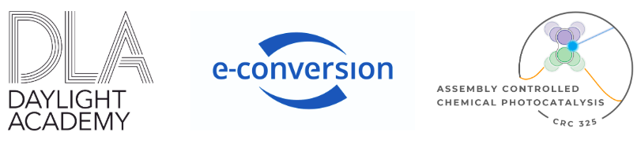

# Information about this Project

Το download and read the book visit our website: <https://tscnlab.github.io/LumisDelight/about.html>

## Summary

Lumi's Delight is an educational comic that follows Lumi, a curious ray of sunlight, on its journey from the Sun to Earth. Along the way, Lumi explores how daylight interacts with the natural world, visiting a variety of ecosystems and learning how light influences life on our planet. The comic introduces both young readers and adults to the science of light and its essential role in biological processes, such as photosynthesis and circadian rhythms. Lumi meets plants, animals, and even microorganisms, uncovering the connections between sunlight and the rhythms of life on Earth. The aim of the comic is to inspire curiosity about natural phenomena, foster scientific literacy, and raise awareness about the importance of daylight in our daily lives.

**Written and illustrated** by Coline Weinz.

**Edited** by Dr. Anna M Biller, Dr. Alejandra Parreño, Dr. Simone Stegbauer, Dr. Verena Streibel, and Dr. Matthew The.

## Funding

The Comic Book was funded by [The Daylight Academy](https://daylight.academy/), [eConversion](https://www.e-conversion.de/de/), and [crc325](https://crc325.de/).

{width="536"}

## How can I contribute?

You can contribute by translating this comic book to your native language. If you are interested, get in touch with Dr. Anna M Biller: [anna.biller\@tum.de](https://tscnlab.github.io/LumisDelight/anna.biller@tum.de)

## Licence

This work is licensed under the [Creative Commons Attribution-NonCommercial-NoDerivatives 4.0 International License](https://creativecommons.org/licenses/by-nc-nd/4.0/).

## Citatation

::: callout-tip
## How to cite this resource:

Weinz, C., Biller, A. M. (Ed.), Parreño, A. (Ed.), Stegbauer, S. (Ed.), Streibel, V. (Ed.) & The, M. (Ed.) (2025). Lumi's Delight (C. Weinz, Illus.). DOI: <https://doi.org/10.14459/2025MD1793458>
:::
